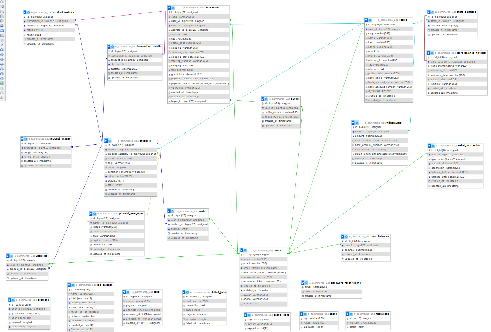

<p align="center">
  
  <h1 align="center">KORÉ – K-Pop Merchandise E-Commerce</h1>
  <p align="center"><i>Your K-Pop Essentials</i></p>
</p>

---

## Tentang Project

**KORÉ** adalah website **e-commerce merchandise K-Pop** yang dikembangkan menggunakan **Laravel 12**.  
Website ini menyediakan berbagai produk kebutuhan dan koleksi penggemar K-Pop, seperti **album, apparel, lightstick, photocard**, serta merchandise pendukung lainnya.

Project ini menerapkan konsep **multi-role user**, yaitu:
- **Pembeli (Customer)**
- **Penjual / Toko (Seller)**
- **Admin**

Seluruh fitur dirancang secara terintegrasi sehingga alur penggunaan website KORÉ berjalan dengan baik, mulai dari pengguna mengakses halaman utama hingga proses transaksi selesai.

---

## Tujuan Pengembangan

Project ini dibuat untuk memenuhi tugas **Ujian Akhir Praktikum Pemrograman Web**, dengan fokus pada:
- Implementasi CRUD berbasis Laravel
- Pengelolaan transaksi e-commerce
- Penerapan autentikasi dan otorisasi user
- Struktur kode yang rapi dan mudah dikembangkan

---

## Fitur Utama

### Customer Side
- Homepage (daftar produk & kategori)
- Detail produk (deskripsi, gambar, kategori, review)
- Cart & Checkout
- Riwayat transaksi
- Wishlist
- Wallet / saldo pengguna

### Seller Dashboard
- Registrasi dan pengelolaan toko
- Manajemen produk (CRUD)
- Manajemen kategori produk
- Manajemen gambar produk
- Manajemen pesanan & pengiriman
- Saldo toko & histori saldo
- Penarikan saldo (withdrawal)

### Admin Panel
- Verifikasi toko
- Manajemen user
- Manajemen toko

---

## Teknologi yang Digunakan

- **Laravel 12**
- **Laravel Breeze** 
- **PHP 8.3+**
- **MySQL**
- **Tailwind CSS**
- **Node.js & NPM**

---

## Struktur Database


Sebelum memulai, pastikan komputer Anda telah terinstal:
- *PHP* (versi 8.3)
- *Composer*
- *Node.js* & *NPM*
- *MySQL* (atau database lain yang didukung Laravel)

 ## Instalasi
  
Ikuti langkah-langkah berikut untuk melakukan instalasi dan menjalankan proyek dalam lingkungan pengembangan di komputer lokal Anda:

1. Clone repository versi terbaru dari sumber yang diberikan:

```bash
git clone https://github.com/amaliamaya1/e-commerce-kelompok-2.git
```
2. masuk ke folder tersebut
```bash
cd e-commerce-kelompok-2
```
3. Instal dependensi PHP menggunakan Composer:
```bash
composer install
```
4. Salin file .env.example menjadi .env lalu sesuaikan konfigurasi database:
```bash
cp .env.example .env
```
5. Generate application key:
```bash
php artisan key:generate
```
6. pastikan xampp menyala, dan di database local kamu sudah buat `database` dengan nama yang sama dengan .env :
```bash
DB_CONNECTION=mysql
DB_HOST=127.0.0.1
DB_PORT=3306
DB_DATABASE=e_commerce_uap
DB_USERNAME=root
DB_PASSWORD=
```
7. Jalankan migrasi database & Seeder
```bash
php artisan migrate
```
Migrasi + Data Dummy (Disarankan)*
Untuk mengisi database dengan data awal (contoh produk, user admin, penjual, dll), jalankan perintah berikut. Ini akan menghapus semua data lama dan menggantinya dengan data baru (fresh):
```bash
php artisan migrate --seed
php artisan migrate:fresh --seed
```
8. Setup Storage Link
Buat symlink agar file di storage/app/public dapat diakses dari web:
```bash
php artisan storage:link
```
9. Jalankan development server Laravel:
```bash
php artisan serve
```
9. buka terminal yang lain (terminal ada 2), Pada terminal lain, install semua modul Node.js dan lakukan build:
```bash
npm install
npm run build
```
10. Kompilasi asset dalam mode pengembangan:
```bash
npm run dev
```
11. Buka browser dan akses aplikasi:
```bash
http://localhost:8000
```

## Fitur yang Diimplementasikan
- [✅] Halaman Homepage
- [✅] Halaman Produk
- [✅] Checkout
- [✅] Riwayat Transaksi (opsional)
- [✅] Registrasi Toko
- [✅] Manajemen Pesanan
- [✅] Saldo Toko
- [✅] Penarikan Saldo
- [✅] Manajemen Toko (produk, kategori, gambar)
- [✅] Verifikasi Toko (Admin)
- [✅] Manajemen User & Toko (Admin)

## Akun Default (Seeder)

Jika Anda menjalankan php artisan migrate:fresh --seed, berikut adalah akun default yang dapat digunakan:

| Role       | Email                | Password    |
| ---------- | -------------------- | ----------- |
| *Admin*  | adminkore@gmail.com  | password    |
| *Seller* | sellermerch@kore.com | password    |
| *Member* | member2@kore.com     | password    |


<h3 align="center">
감사합니다 (Gamsahamnida) 🌸  
Terima kasih atas ilmu dan bimbingannya  
selama UAP Pemrograman Web.  
Project KORÉ ini kami buat dengan semangat K-Pop.  
Tetap semangat dan sukses selalu, PHP lovers 💕
</h3>
